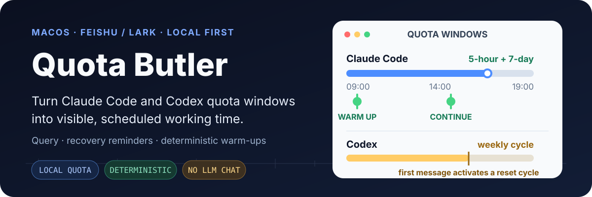
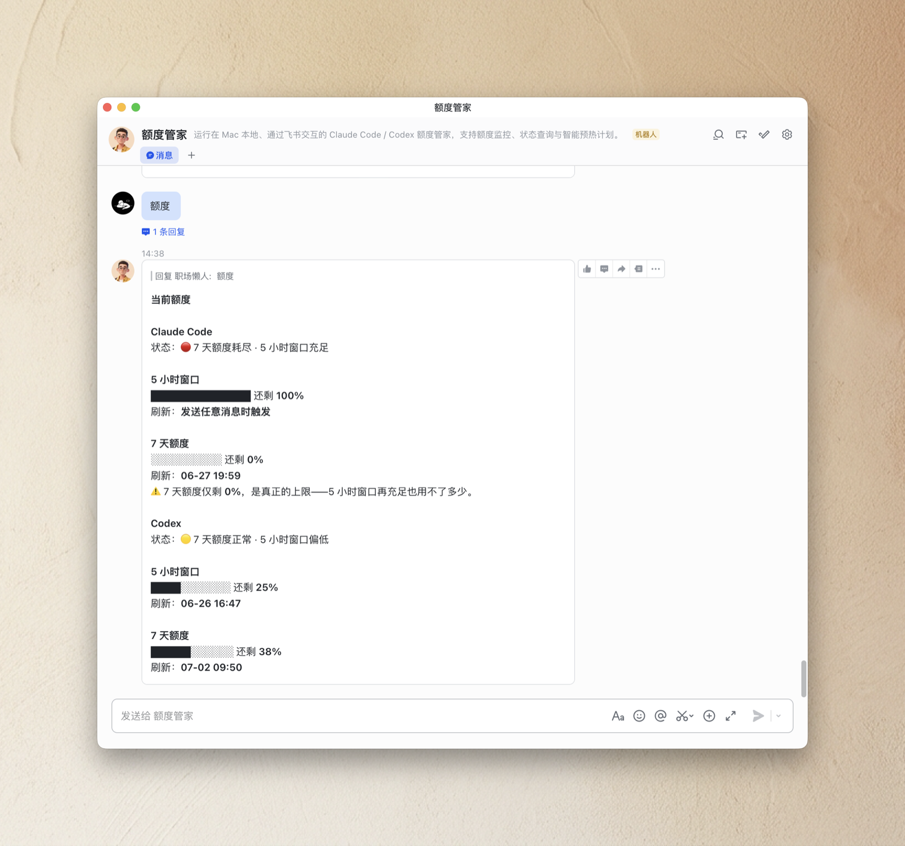
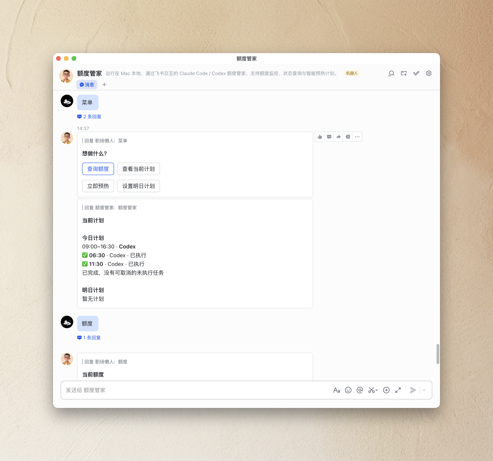
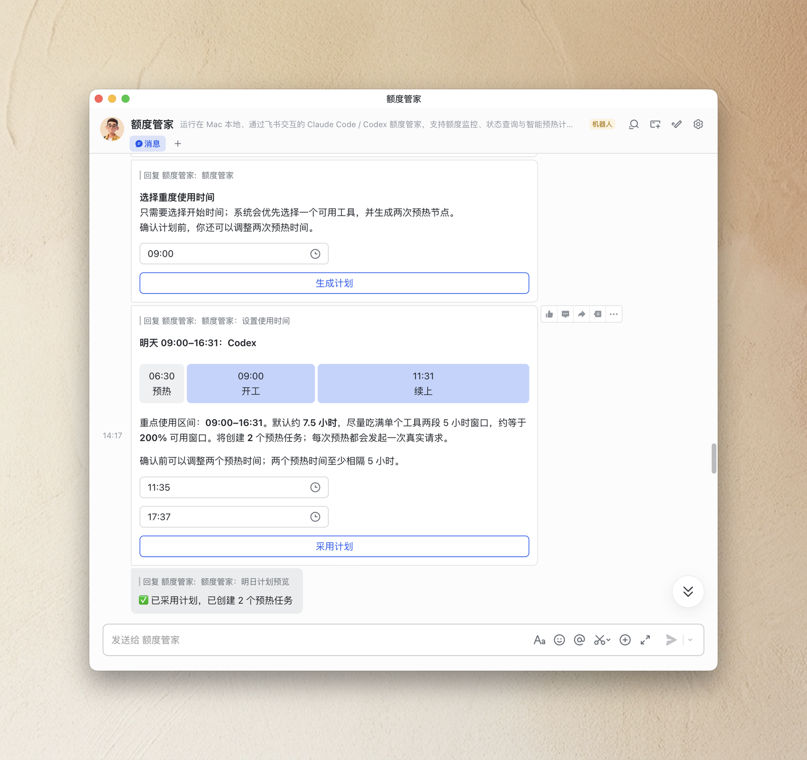
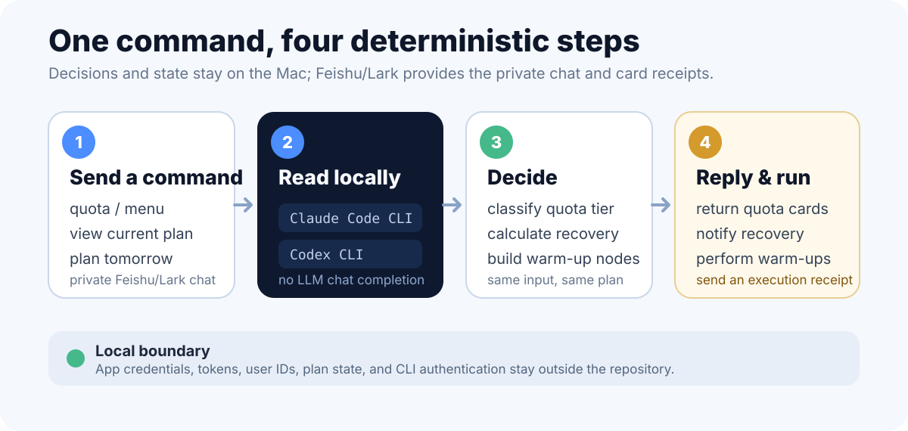

<p align="right">
  <a href="./README.md">中文</a> · <strong>English</strong>
</p>

<p align="center">
  
</p>

Quota Butler is a local macOS helper for Claude Code and Codex users. It talks to you through a private Feishu/Lark bot chat, but it does not use an LLM for chat completion or forward your chat messages for model reasoning. It only runs deterministic quota checks, status reminders, and warm-up scheduling.

You can see 5-hour, 7-day, or monthly quota, identify the limit that actually blocks your work, and prepare tomorrow's heavy usage window before it begins.

## Real Interface

These three images come from real Feishu conversations. Click any image to view it at full size.

<p align="center">
  <a href="./docs/images/quota-status.png"></a>
  <a href="./docs/images/menu-and-current-plan.png"></a>
  <a href="./docs/images/tomorrow-plan.png"></a>
</p>

<p align="center">
  <sub>Quota status · Menu and current plan · Tomorrow plan</sub>
</p>

The screenshots preserve real interfaces from the product's evolution. V1.4 changed the weekly Codex strategy; the current behavior is described under “Quota and warm-up rules.”

## What It Does

- **Shows the real limit**: displays Claude Code and Codex quota, remaining percentage, and reset time together. A full-looking 5-hour window cannot hide a depleted long-term cap.
- **Notifies recovery**: detects quota-window recovery and sends an actionable card to the private bot chat.
- **Plans tomorrow**: turns one start time into a deterministic schedule, performs real warm-up requests at the chosen nodes, and reports each result.

## How It Works

<p align="center">
  
</p>

Quota Butler only reads the locally authenticated Claude Code and Codex CLIs. Feishu/Lark provides the private chat and card interactions; quota decisions, plan state, and scheduled execution stay on the Mac.

### Quota and warm-up rules

- **Claude Code and legacy Codex quota**: when a 5-hour window exists, a plan can place two warm-ups to cover a continuous focused-work period.
- **Weekly-only Codex**: while the current weekly cycle is active, Codex can be used directly. Quota Butler does not invent a daily 5-hour window or schedule meaningless daily warm-ups.
- **A new Codex weekly cycle**: an adopted plan offers “Append Codex weekly activation” only when the known reset falls inside that plan. At the scheduled time, the first message starts the new cycle.
- **Real execution**: a warm-up calls the corresponding CLI and sends a real request; it is not merely a reminder.

## First Run

The current stable release is **V1.4**. The default `main` branch points to the current version after automated verification and maintainer device dogfooding.

```bash
npx github:manwithshit/quota-butler run
```

On first run:

1. A QR code appears in the terminal.
2. Scan it with the Feishu/Lark app to create and bind a personal bot automatically.
3. Open the new Quota Butler bot chat.
4. Send `额度` or `菜单`.

You do not need to create a Feishu developer app manually or configure lark-cli.

To pin this release or roll back later:

```bash
npx github:manwithshit/quota-butler#v1.4.0 run
```

## Requirements

- macOS with `launchd`
- Node.js 20.12+
- Claude Code CLI and/or Codex CLI installed and signed in locally
- A Feishu/Lark account

## Feishu/Lark Commands

Supported text commands:

```text
额度
查看额度
quota
菜单
帮助
menu
help
```

Other messages fall back to the menu so the available actions remain discoverable. The product binds to a private bot chat only; group chats are not used as proactive notification targets.

## Background Daemon

After the foreground run can send and receive messages, install the macOS background daemon:

```bash
npx github:manwithshit/quota-butler start
npx github:manwithshit/quota-butler status
npx github:manwithshit/quota-butler stop
```

If your network requires a proxy, set `QUOTA_BUTLER_PROXY` before starting:

```bash
export QUOTA_BUTLER_PROXY=http://127.0.0.1:7890
npx github:manwithshit/quota-butler start
```

Without this variable, the daemon connects directly.

## CLI

```text
quota-butler run        Foreground run and first QR setup
quota-butler start      Install and start the macOS background daemon
quota-butler stop       Stop the daemon
quota-butler status     Show daemon status
quota-butler selftest   Offline self-test without Feishu/Lark
quota-butler report     Preview the daily report card
```

## Local Data and Privacy

Runtime files live outside the repository:

```text
~/.quota-butler/config.json
~/.quota-butler/state.json
~/.quota-butler/logs/
Claude Code / Codex auth files
```

Feishu/Lark app credentials, access tokens, `open_id`, `chat_id`, local state, and Claude Code or Codex authentication should remain on the Mac and must not be committed.

## Known Limitations

- A sleeping or powered-off Mac can miss scheduled actions. Clearly stale actions are skipped after wake and reported to the owner.
- Codex weekly activation uses the latest reset timestamp known when the plan is created. It does not yet re-query at execution time to detect a cycle that the user started manually.

## Development and Release

```bash
npm install
npm test
npm run typecheck
npm run build
node dist/cli.mjs selftest
```

The test suite covers quota parsing, plan generation, adoption and cancellation, quiet hours, state persistence, warm-up locking, Feishu card copy, and provider classification.

The project maintains one public release entry point:

```text
main          The only public release branch; contains the current verified version.
agent/*       Focused feature or fix branches; merged into main after tests and review.
```

New versions pass tests and real-device validation on a focused branch before they are merged into `main` through a pull request and tagged.

## License

[MIT](./LICENSE)
