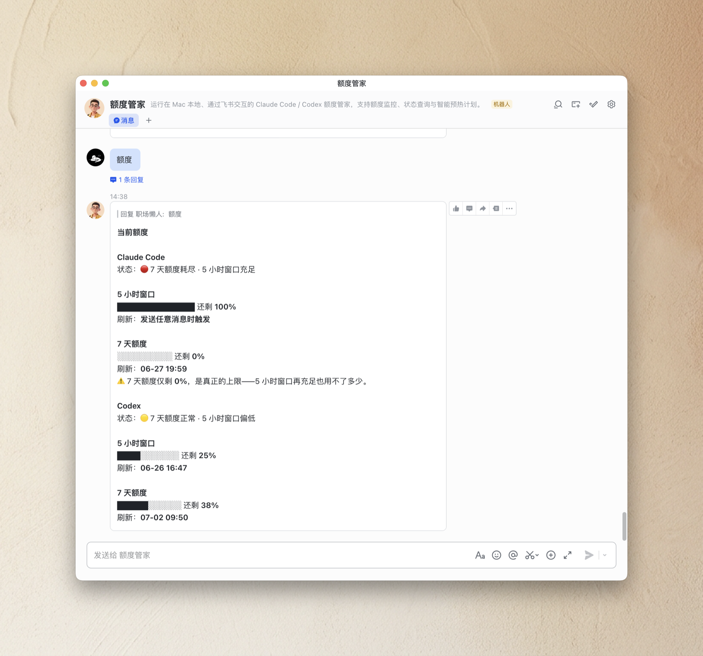
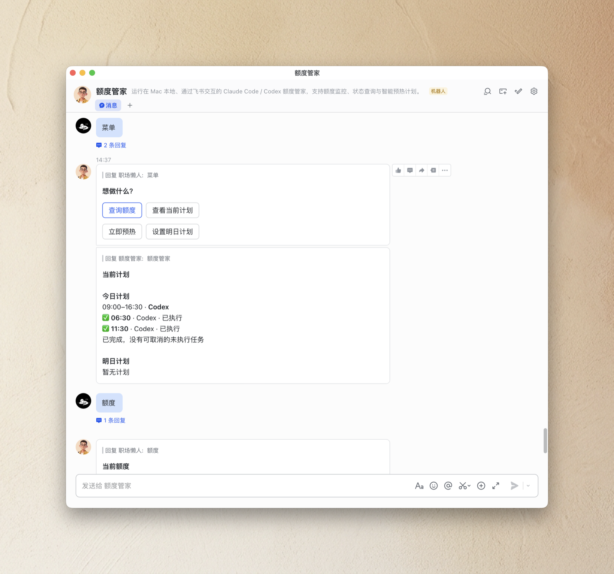
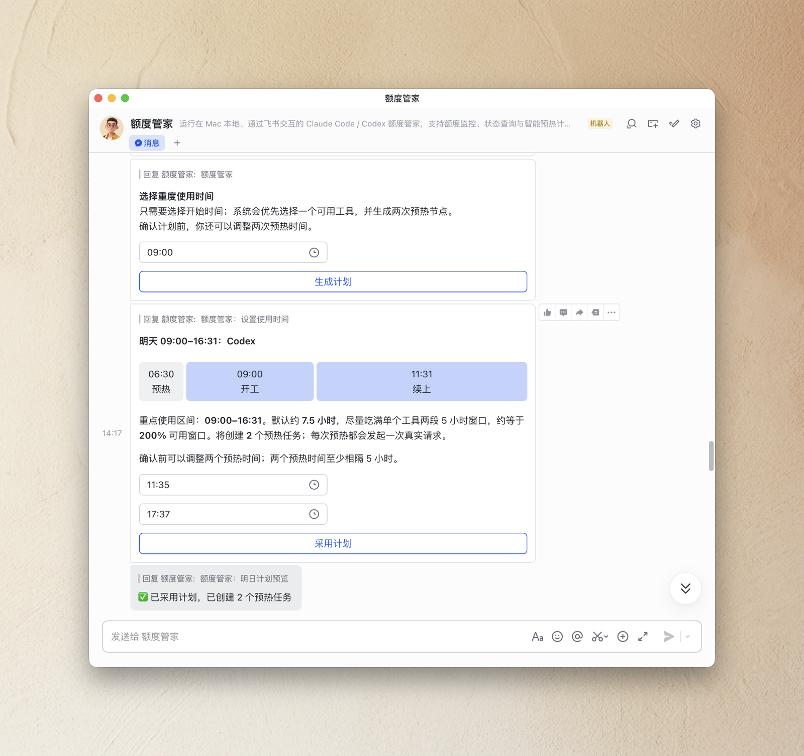

# 额度管家 Quota Butler

中文 | [English](README.en.md)

额度管家是一个运行在 Mac 本地、通过飞书/Lark 私聊交互的 Claude Code / Codex 额度助手。它不接大模型聊天，也不会把你的消息发给模型推理；它只做确定性的额度查询、状态提醒和预热计划编排。

它的目标是让你最大化利用已经拥有的额度：看得见 5 小时窗口和 7 天额度，知道什么时候恢复，提前安排明天的重度使用时间，并让本机在合适的时间点自动预热。

## 功能预览

### 查询额度

同时展示 Claude Code 和 Codex 的 5 小时窗口、7 天额度或月度额度、剩余百分比和刷新时间。状态判断会优先看长期额度：如果 7 天额度耗尽，即使 5 小时窗口充足，也会提示真正的上限在周额度。



### 飞书菜单与当前计划

发送 `菜单` 后，可以直接在飞书卡片里查询额度、查看当前计划、立即预热、设置明日计划。当前计划会分开展示今日和明日；已执行、未执行、失败、已取消的节点会有明确状态。



### 自动编排明日计划

只需要选择一个开始时间，系统会按当前可用额度优先选择一个 AI 工具，并生成两次预热节点。默认策略会尽量吃满单个工具两段 5 小时窗口，形成约 7.5 小时、接近 200% 的重点使用区间。采用计划前，你仍然可以调整两次预热时间。



## 安装要求

- macOS，支持 `launchd`
- Node.js 20.12+
- 本机已安装并登录 Claude Code CLI 或 Codex CLI
- 一个飞书/Lark 账号

首次运行会在终端显示二维码。用飞书/Lark 扫码后，会自动创建并绑定额度管家的个人机器人，不需要手动去开放平台创建应用，也不需要配置 lark-cli。

## 快速开始

```bash
npx github:manwithshit/quota-butler run
```

首次运行：

1. 终端出现二维码。
2. 用飞书/Lark App 扫码完成应用创建。
3. 打开新建的额度管家机器人私聊。
4. 发送 `额度` 或 `菜单`。

确认能正常收发后，可以让它后台常驻：

```bash
npx github:manwithshit/quota-butler start
npx github:manwithshit/quota-butler status
npx github:manwithshit/quota-butler stop
```

## 飞书/Lark 入口

支持的文字命令：

```text
额度
查看额度
quota
菜单
帮助
menu
help
```

其它消息会默认回复菜单，方便发现可用操作。项目当前只绑定独立机器人的私聊，不使用群聊作为主动提醒目标。

## 命令一览

```text
quota-butler run        前台运行，首次扫码
quota-butler start      安装并启动 macOS 后台常驻
quota-butler stop       停止后台常驻
quota-butler status     查看后台状态
quota-butler selftest   离线自检，不连接飞书
quota-butler report     预览晚间回顾卡
```

## 本地文件

运行时文件都在仓库外：

```text
~/.quota-butler/config.json
~/.quota-butler/state.json
~/.quota-butler/logs/
Claude Code / Codex 登录文件
```

敏感信息只保存在本机。飞书应用凭证、访问令牌、open_id、chat_id、本地状态文件、Claude Code / Codex 登录信息都不要提交到仓库。

## 开发

```bash
npm install
npm test
npm run typecheck
npm run build
node dist/cli.mjs selftest
```

核心逻辑覆盖在测试里：额度状态解析、计划生成、计划采用/取消、静默时段、预热回执、飞书卡片文案和 provider 状态分类。
