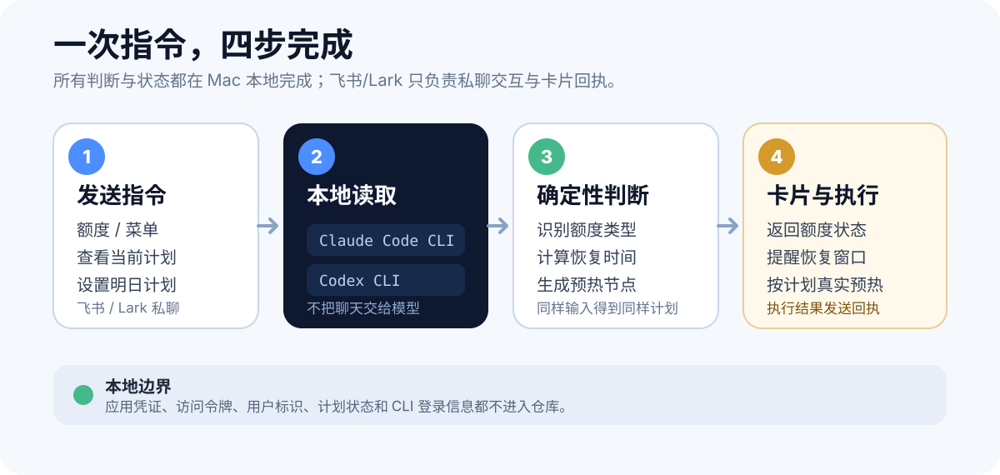

<p align="right">
  <strong>中文</strong> · <a href="./README.en.md">English</a>
</p>

<p align="center">
  
</p>

额度管家是一个运行在 Mac 本地、通过飞书/Lark 私聊交互的 Claude Code / Codex 额度助手。它不接大模型聊天，也不会把你的聊天消息发给模型推理；它只做确定性的额度查询、状态提醒和预热计划编排。

你可以随时看清 5 小时窗口、7 天额度或月度额度，知道真正限制你的额度何时恢复，并提前安排明天的重度使用时间。

## 真实界面

下面三张图来自真实飞书会话。点击图片可以查看原尺寸。

<p align="center">
  <a href="./docs/images/quota-status.png"></a>
  <a href="./docs/images/menu-and-current-plan.png"></a>
  <a href="./docs/images/tomorrow-plan.png"></a>
</p>

<p align="center">
  <sub>额度查询 · 菜单与当前计划 · 明日计划</sub>
</p>

这些截图保留了产品演进过程中的真实界面。V1.4 已更新 Codex 周额度策略，当前行为以本文“额度与预热规则”为准。

## 它能做什么

- **看清真实上限**：同时展示 Claude Code 和 Codex 的额度、剩余比例与重置时间。长期额度耗尽时，不会被看似充足的 5 小时窗口误导。
- **在恢复时提醒**：检测额度窗口恢复，并在飞书私聊里发送可操作的卡片。
- **提前安排明天**：选择开始时间后生成确定性计划，在合适的节点发起真实请求完成预热，并回传执行结果。

## 工作机制

<p align="center">
  
</p>

额度管家只读取本机已经登录的 Claude Code / Codex CLI 状态。飞书/Lark 负责私聊入口和卡片交互；额度判断、计划状态与定时执行都在 Mac 本地完成。

### 额度与预热规则

- **Claude Code / 传统 Codex 额度**：有 5 小时窗口时，计划可以安排两次预热，尽量覆盖一段连续的重点工作时间。
- **Codex 仅周额度**：当前周周期有效时直接使用，不伪造每日 5 小时窗口，也不安排无意义的每日预热。
- **Codex 新周周期**：只有已知重置点落在计划区间内，已采用的计划才会提供“追加 Codex 新周期预热”；到点后发送第一条消息开启新周期。
- **真实执行**：预热会调用对应 CLI 发起真实请求，不是只发送一条提醒。

## 5 分钟开始

当前稳定版本为 **V1.4**。默认分支 `main` 始终指向已经完成自动化验证和维护者真实设备 dogfood 的当前版本。

```bash
npx github:manwithshit/quota-butler run
```

首次运行：

1. 终端显示二维码。
2. 用飞书/Lark App 扫码，自动创建并绑定个人机器人。
3. 打开新建的额度管家机器人私聊。
4. 发送 `额度` 或 `菜单`。

不需要手动创建飞书开放平台应用，也不需要配置 lark-cli。

需要固定版本或回滚时：

```bash
npx github:manwithshit/quota-butler#v1.4.0 run
```

## 运行要求

- macOS，支持 `launchd`
- Node.js 20.12+
- 本机已安装并登录 Claude Code CLI 和/或 Codex CLI
- 一个飞书/Lark 账号

## 飞书/Lark 入口

支持的文字命令：

```text
额度
查看额度
quota
菜单
帮助
menu
help
```

其它消息会默认回复菜单，方便发现可用操作。项目只绑定独立机器人的私聊，不使用群聊作为主动提醒目标。

## 后台常驻

确认前台能够正常收发后，可以安装 macOS 后台守护：

```bash
npx github:manwithshit/quota-butler start
npx github:manwithshit/quota-butler status
npx github:manwithshit/quota-butler stop
```

需要代理时，在启动前设置 `QUOTA_BUTLER_PROXY`：

```bash
export QUOTA_BUTLER_PROXY=http://127.0.0.1:7890
npx github:manwithshit/quota-butler start
```

未设置代理变量时，后台进程保持直连。

## CLI

```text
quota-butler run        前台运行，首次扫码
quota-butler start      安装并启动 macOS 后台常驻
quota-butler stop       停止后台常驻
quota-butler status     查看后台状态
quota-butler selftest   离线自检，不连接飞书
quota-butler report     预览晚间回顾卡
```

## 本地数据与隐私

运行时文件都在仓库外：

```text
~/.quota-butler/config.json
~/.quota-butler/state.json
~/.quota-butler/logs/
Claude Code / Codex 登录文件
```

飞书应用凭证、访问令牌、`open_id`、`chat_id`、本地状态以及 Claude Code / Codex 登录信息都只应保存在本机，不要提交到仓库。

## 已知限制

- Mac 睡眠或关机可能导致定时节点错过；恢复后会跳过明显过时的任务并发送回执。
- Codex 新周期激活使用计划创建时最后读取到的重置点；执行前暂不重新查询用户是否已经手动开启周期。

## 开发与发布

```bash
npm install
npm test
npm run typecheck
npm run build
node dist/cli.mjs selftest
```

核心测试覆盖额度状态解析、计划生成与采用/取消、静默时段、状态持久化、预热互斥、飞书卡片文案和 provider 分类。

项目只维护一个对外版本入口：

```text
main          唯一对外发布分支，只接受已完成验证的当前版本。
agent/*       单项开发或修复分支，通过测试和 PR 后合入 main。
```

新版本先在独立分支通过测试和真实设备验证，再通过 PR 合入 `main` 并打版本标签。

## License

[MIT](./LICENSE)
